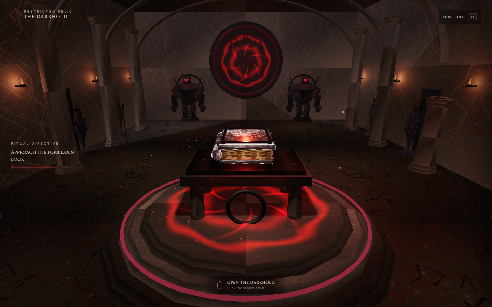

# The Darkhold Sanctum

An original interactive Three.js scene built for the **“A Book”** computer graphics assignment. The page begins outside a ruined temple, facing one monumental carved door between pillars, steps, vines, and lanterns. Clicking the door slowly opens it inward before the camera enters the great hall and reveals a floating Darkhold above a ritual altar, guarded by paired demon statues and a Scarlet Witch-inspired wall relief.



## Run the project

Requirements: Node.js 20.19+ or 22.12+.

```bash
npm install
npm run dev
```

Open the local URL printed by Vite. A production build can be created with:

```bash
npm run build
npm run preview
```

Do not open `index.html` directly with `file://`; ES modules must be served over HTTP.

## Controls

| Input | Action |
|---|---|
| Click the carved door | Slowly open the temple and begin the camera movement |
| Enter | Keyboard alternative for opening the doors |
| A / D or Left / Right | Orbit the perspective camera around the book |
| W / S or Up / Down | Move closer to or farther from the book |
| Q / E | Raise or lower the camera |
| Mouse drag | Orbit and tilt the camera |
| Mouse wheel | Zoom |
| Click closed book | Open the cover |
| Click right page | Turn the next page |
| Click left side | Turn a page back, then close the book |
| C | Cycle through six photographed cover designs |
| R | Reset the camera |
| H | Show or hide the controls panel |

## Assignment requirements

| Requirement | Implementation |
|---|---|
| Custom shaders | Hand-written GLSL corruption sigils, animated floor/wall energy, atmospheric mist, and GPU ember particles in `src/shaders.js` |
| Lighting | Hemisphere, directional, spot, torch, guardian, book-glow, and a red point light that continuously orbits the book |
| Perspective projection | `THREE.PerspectiveCamera` with responsive aspect-ratio updates |
| Texture for each object | Canvas-generated architecture materials plus six supplied cover designs and six illustrated page textures assembled in `src/textures.js` |
| Animation | Opening doors, floating/pulsing book, hinged cover and pages, moving embers/mist, flickering torches, and orbiting light |
| Mouse interaction | Drag camera, wheel zoom, raycast clicks to open/close the book and flip pages |
| Keyboard interaction | Camera orbit/dolly/elevation, cover-texture switching, reset, and help controls |
| Book + table | Fully procedural multi-part book above a four-legged ritual altar |

## Scene features

- A direct, text-free exterior entrance using the supplied Wundagore relief, surrounded by dead roots, skull niches, weathered occult marks, debris, low mist, broad steps, and lanterns.
- A 46 × 88-unit great hall with a 22-unit ceiling, repeated structural arches, and long sightlines.
- A cracked, radial, moss-stained ritual floor with scattered damage instead of a regular tile grid.
- Central three-tier ritual platform and textured altar.
- A reference-led Darkhold with rugged blackened plates, thick stacked parchment, restrained raised metal framing, hinges, and rivets.
- Six distinct cover designs cropped from the supplied reference collage.
- Six restored image-backed Darkhold pages with forward and backward page turning.
- Four hulking procedural tomb guards embedded into the side and north walls with backing slabs, iron restraints, claws, horns, glowing eyes, and dedicated lighting.
- Eight additional crowned sentinel statues occupy the wall bays between the hall's pillars.
- Scarlet Witch-inspired north-wall crown/face engraving assembled from tube geometry.
- Broken pillars, scattered stone debris, ceiling ribs, wall torches, fog, mist, and drifting embers.
- Responsive UI, WebGL error fallback, reduced-motion CSS support, and capped mobile pixel ratio.

## Project structure

```text
├── index.html            UI and semantic overlays
├── styles.css            Cinematic HUD and responsive styling
├── src/
│   ├── main.js           Renderer, perspective camera, input, raycasting, loop
│   ├── temple.js         Architecture, statues, altar, lighting, scene animation
│   ├── book.js           Darkhold geometry and page/cover interaction state
│   ├── shaders.js        Custom GLSL materials
│   └── textures.js       Procedural and image-backed texture library
├── public/assets/        Cover/page textures and attribution notes
├── tests/
│   ├── smoke.mjs         Browser smoke test
│   └── *.png             Verified visual captures
├── public/favicon.svg
├── Lab 5.zip             Original class material (unchanged)
└── Lab 6.zip             Original class material (unchanged)
```

## Technical notes

The scene uses no downloaded 3D models. Its architecture, book geometry, particles, and symbols are created by the project at runtime. The cover collage supplied by the user and three externally sourced image spreads are used as book textures; source links are recorded in `public/assets/CREDITS.md`. The supplied class archives remain untouched and were used only as the instructional baseline for Three.js shaders, textures, model structure, and interaction.

The design is inspired by the user's provided supernatural-temple references but is an original implementation rather than a copy of the linked museum repository.

## Verification

The project has been checked with a production build and a Chromium smoke test. The test verifies that:

- the scene reaches exploration mode;
- the camera is a perspective camera;
- the doors complete their animation;
- keyboard orbit and cover-texture switching work;
- a real pointer click opens the book;
- no browser console or page errors are produced.

To rerun the smoke test, start the dev server on port 5173 and run `npm run test:smoke` in another terminal.
