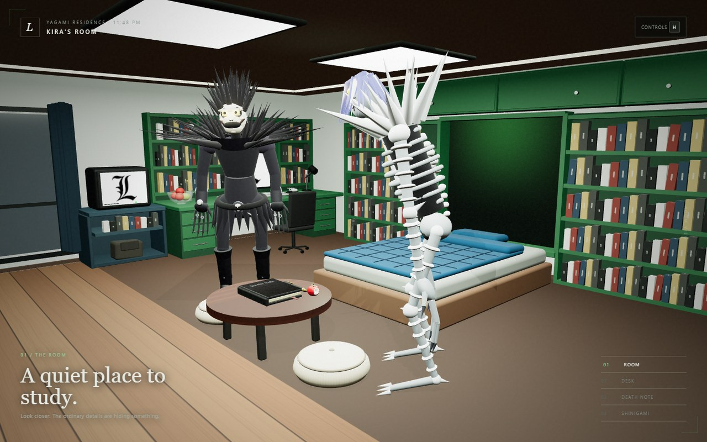
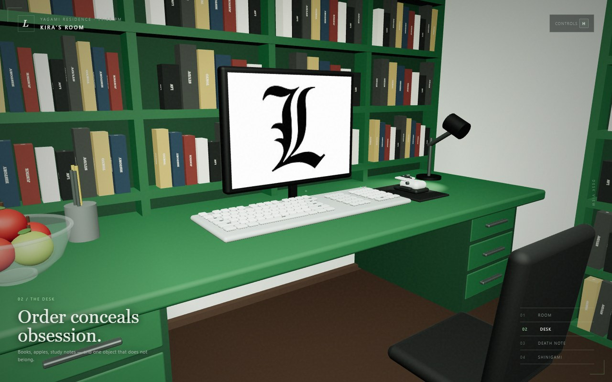
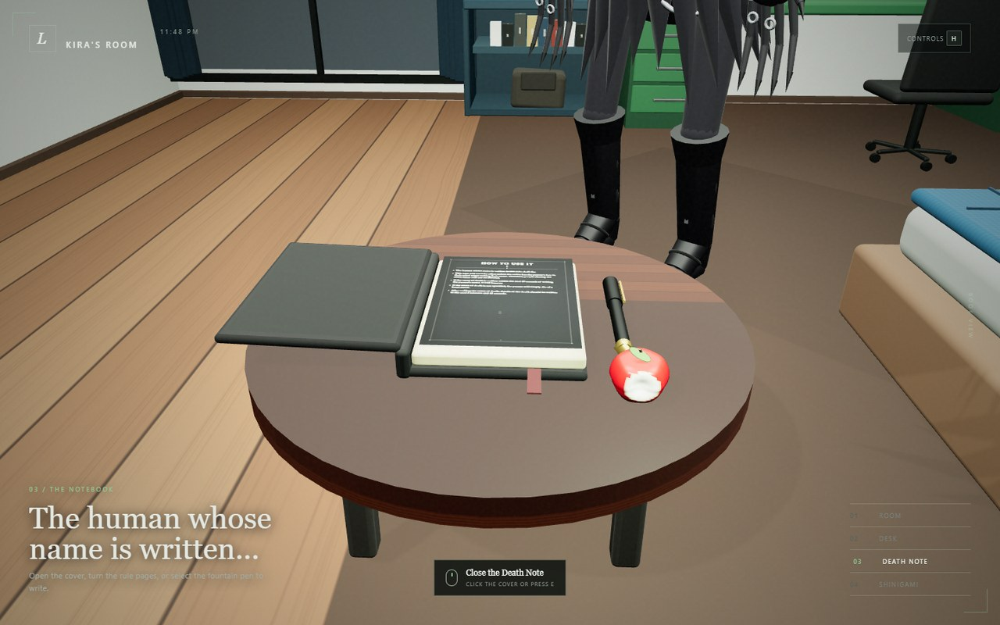
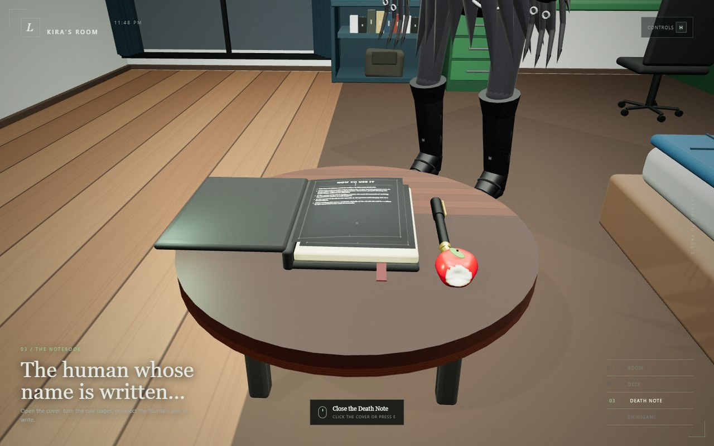

# Kira's Room — Interactive Death Note

An interactive Three.js reconstruction of Light Yagami's bedroom centered on a fully animated Death Note. The scene combines a large, enclosed room, procedural materials, custom GLSL, dynamic lighting, mouse and keyboard navigation, page-turn animation, and clickable book interactions.



## Assignment coverage

| Requirement | Implementation |
|---|---|
| 3D objects | Textured Death Note and wooden reading table, plus the complete bedroom, desk, shelves, computer, CRT television, seating, props, and Shinigami figures |
| Custom shader | Hand-written vertex and fragment shaders create the animated green glow and grain inside the bed alcove |
| Lighting | Hemisphere and directional room lights, recessed ceiling area lights, a desk spotlight, and a point light that continuously orbits the Death Note |
| Perspective projection | A responsive `THREE.PerspectiveCamera` with four authored viewpoints and bounded free movement |
| Object textures | Procedural wood, leather, paper, fabric, book-spine, and notebook textures, together with the supplied Death Note cover and L-screen artwork |
| Animation | Smooth camera transitions, opening and closing cover, curled two-sided page turns, animated shader glow, moving book light, and subtle Shinigami motion |
| Keyboard interaction | Move or orbit the camera, switch views, open the book, change its cover finish, reset the view, and toggle the help panel |
| Mouse interaction | Orbit and zoom the camera, select viewpoints, open or close the book, turn pages, select the fountain pen, and write on lined pages |





## Scene features

- A 24 × 18 unit enclosed room with camera bounds that prevent the exterior from appearing during navigation.
- North wall: bed, mattress, fitted blanket and pillow, illuminated alcove, floor-length bookshelves, and upper cupboards.
- West wall: balcony glazing and curtains, CRT television cabinet with book and bag compartments, extended two-pedestal desk, computer, keyboard, mouse, lamp, pen holder, apples, and chair.
- South wall: wide air conditioner and full-height curtained window.
- East wall: room door, full-height bookshelves, upper cupboards, and adjoining closet.
- Recessed tray ceiling with two luminous panels and perimeter lighting.
- Round reading table south of the bed with two upholstered floor cushions.
- Death Note with five rule pages, a Lind L. Tailor/notebook sequence, lined pages, correct two-sided page turning, automatic reset after closing, and a usable fountain pen.
- Four camera views: Room, Desk, Death Note, and Shinigami.

## Run locally

Node.js 20.19+ or 22.12+ is recommended.

```bash
npm install
npm run dev
```

Open the URL printed by Vite. The project uses ES modules, so do not open `index.html` directly with `file://`.

Production validation:

```bash
npm run build
npm run preview
npm run test:smoke
```

If Windows reports an `EPERM` lock inside `node_modules/.vite`, close other Vite processes and editors using that cache, then rerun the development command with `npm run dev -- --force`.

## Controls

| Input | Action |
|---|---|
| `1` / `2` / `3` / `4` | Switch to Room, Desk, Death Note, or Shinigami view |
| `W` / `A` / `S` / `D` | Move through the room; orbit around the book while in Death Note view |
| Arrow keys | Orbit around the Death Note |
| `Q` / `E` | Lower or raise the camera; `E` opens or closes the book in Death Note view |
| Mouse drag | Orbit the camera around the current target |
| Mouse wheel | Zoom in or out |
| Click the Death Note | Open or close the cover |
| Click an exposed page | Turn to the next page |
| Click the fountain pen, then a lined page | Write names on the selected notebook page |
| `C` or `T` | Cycle the leather cover finish |
| `R` | Reset the current viewpoint |
| `H` | Show or hide the controls panel |



## Project structure

- `index.html` — application shell, loading state, navigation, and help interface
- `styles.css` — responsive cinematic interface styling
- `src/main.js` — WebGL renderer, perspective camera, input handling, view transitions, raycasting, and animation loop
- `src/room.js` — room architecture, furniture, props, lights, and animated orbit light
- `src/book.js` — Death Note geometry, cover states, fountain pen, page state, and page-turn animation
- `src/textures.js` — procedural canvas textures and page artwork
- `src/shaders.js` — custom GLSL alcove material
- `src/shinigami.js` — modeled Ryuk and Rem figures and idle animation
- `public/references/` — supplied visual references used to guide the reconstruction
- `tests/smoke.mjs` — browser rendering and interaction smoke test
- `reports/` — final course report generated from the provided template

## Technology

JavaScript, HTML5, CSS3, Three.js 0.160, WebGL, GLSL, Vite, and Playwright Core.

## Team

- Shuhrid Abrar — `20220104028`
- Mahadir Rahaman — `20220104046`

All scene geometry and procedural materials were created for this project. Images under `public/references/` are supplied visual references and are not runtime source code, except for the explicitly used Death Note cover and L-screen artwork.
