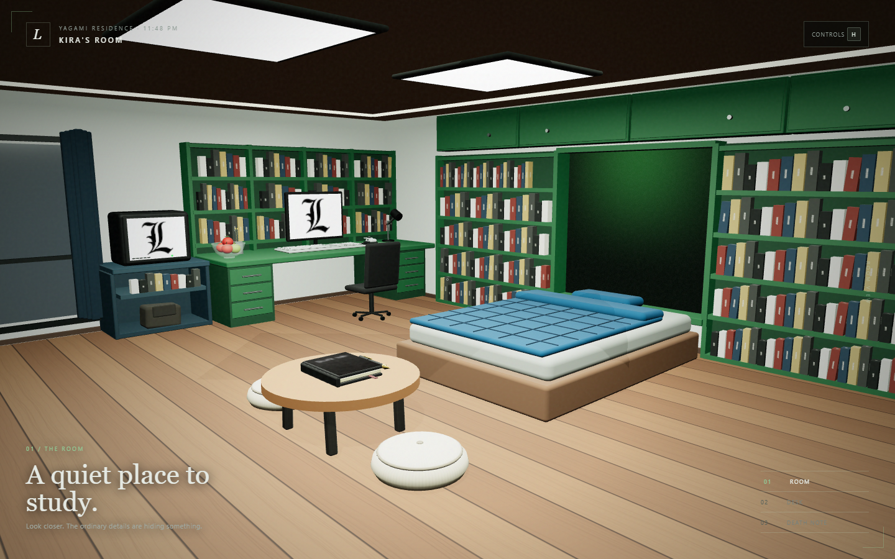
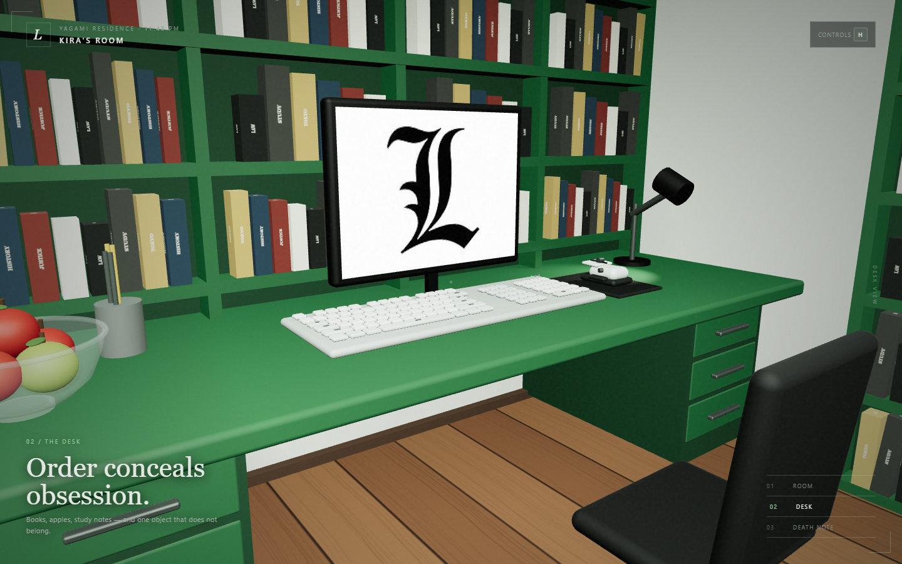
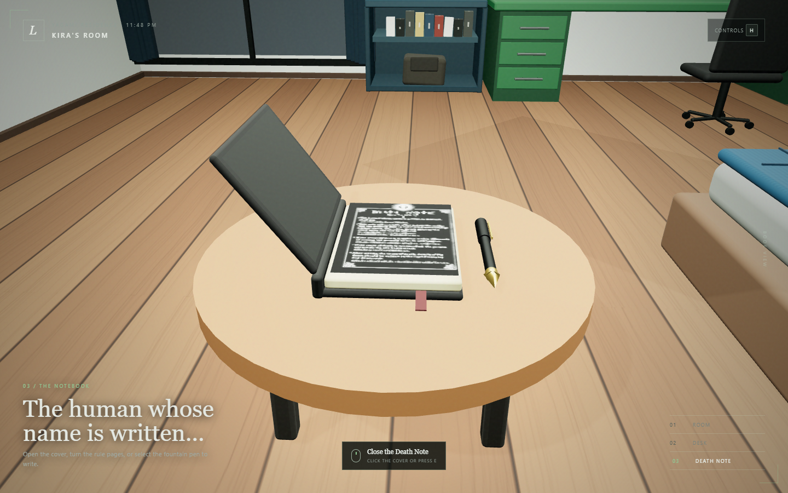

# Kira's Room — Death Note

The first milestone of a from-scratch Three.js recreation of Light Yagami's bedroom and desk. The scene follows the supplied architectural references: green built-in shelves, book-lined walls, wood flooring, the blue bed, balcony glazing and curtains, study desk, computer, lamp, apples, chair, and a Death Note placed beside the keyboard.

The rebuilt room uses a 24 × 18 unit enclosed floor plan with camera bounds on every axis. Its north wall contains the bed alcove and flanking libraries; the west wall contains the complete study/TV/balcony sequence; the south wall contains the AC and curtained window; and the east wall contains the entry, library and closet. A recessed luminous ceiling tray and two square fixtures illuminate the full space.







## Run

Requires Node.js 20.19+ or 22.12+.

```bash
npm install
npm run dev
```

Open the URL printed by Vite. Do not open `index.html` with `file://`; the project uses ES modules.

Production validation:

```bash
npm run build
npm run preview
npm run test:smoke
```

## Controls

| Input | Action |
|---|---|
| 1 / 2 / 3 | Move to room, desk, or Death Note view |
| W / A / S / D | Move through the room |
| Q / E | Lower or raise the view (`E` opens the book in book view) |
| Mouse drag | Orbit the camera around the current target |
| Mouse wheel | Zoom |
| Click the Death Note | Open or close the cover |
| Click an exposed page | Turn the page |
| C | Cycle the procedural leather finish |
| R | Reset the current view |
| H | Show or hide the controls panel |

## Assignment requirements

| Requirement | Implementation |
|---|---|
| Custom shaders | Hand-written animated GLSL material for the illuminated green bed alcove in `src/shaders.js` |
| Lighting | Hemisphere fill, ceiling point light, desk spotlight, rectangular alcove light, and a continuously orbiting book light |
| Perspective projection | Responsive `THREE.PerspectiveCamera` with three authored viewpoints and free movement |
| Object textures | Procedural wood, leather, paper, fabric, display, and labeled-book textures in `src/textures.js` |
| Animation | Smooth camera transitions, animated light, breathing shader, articulated cover, and page-turn motion |
| Mouse interaction | Drag orbit, wheel zoom, cover open/close, page turning, and clickable viewpoint UI |
| Keyboard interaction | Movement, view selection, cover finish cycling, reset, help, and book control |

## Project structure

- `src/main.js` — renderer, perspective camera, interaction, views, and animation loop
- `src/room.js` — room shell, built-ins, furniture, props, lights, and composition
- `src/book.js` — Death Note geometry, binding, cover animation, and page-turn system
- `src/textures.js` — original procedural canvas textures
- `src/shaders.js` — custom GLSL alcove material
- `public/references/` — the user-supplied visual references used for this recreation
- `tests/smoke.mjs` — browser render and interaction smoke test
- `Lab 5.zip`, `Lab 6.zip` — preserved lab materials

## Current milestone

The room and physical book are implemented. The book currently contains a small page-system prototype so opening and turning can be validated. The full 67-rule sequence, final page typography, navigation through all rule pages, and regular lined pages are intentionally reserved for the next milestone.

All modeled geometry and generated materials in the implementation are original to this project; the supplied images are kept only as visual references.
